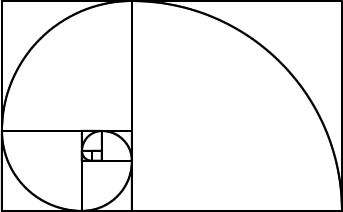

# Qubitry
3D open-source, algorithm grapher. Objective imaging.

## Screenshots

## Core fundamentals

• Geometrical AI solving write, as .obj file data.

• Graphing output.

• AI shape recognition.

• Logical interference.
