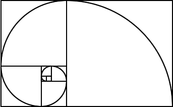
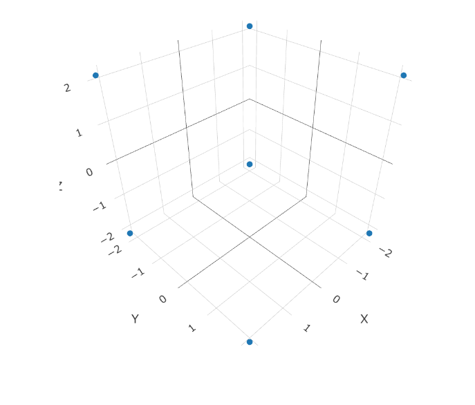

# Qubitry
3D open-source, algorithm grapher. Objective imaging.

Qubitry is an AI-powered 3D shape generation system that creates geometric objects using machine learning algorithms. The system trains AI cores to generate OBJ files for various 3D shapes like cubes and spheres, with an interactive Node.js-based UI for visualization.

## Core Fundamentals

• Geometrical AI solving write, as .obj file data.

• Graphing output.

• AI shape recognition.

• Logical interference.

## Screenshots



## Prerequisites

- GCC compiler
- Node.js (for UI components)
- Linux/macOS environment

## Build Instructions

1. Compile the C core:
```bash
gcc -DONECOREAI_NO_MAIN -o main .src/main.c OneCoreAI/.core/init.c -lm
```

## Usage

### Launch Interactive Menu (Recommended)

```bash
cd OneCoreAI/shaper && make run
```

Choose from the menu: generate custom shapes, run demos, view outputs, or access documentation.

The program will:
1. Train an AI core with visualization
2. Generate an OBJ file
3. Create utility points file and update the 3D graph visualization

### Quick Commands

```bash
make demo               # Generate 5 example shapes
make sphere             # Quick sphere generator
make cube               # Quick cube generator
make torus              # Quick torus generator
make view               # List all generated shapes
make help               # Show all available commands
```

### Custom Generation (Predefined Shapes or Custom Coordinates)

```bash
# Predefined shapes
./main "geometric cube" "cube"
./main "perfect sphere" "sphere"

# Custom coordinates (semicolon-separated triples)
./main "0,0,0; 1,0,0; 1,1,0; 0,1,0" "custom"
```

Launch the Node.js interface for shape identification and visualization:
```bash
node qubitry/node.js
```

The UI will:
- Prompt for a shape name or a list of coordinates
- Generate OBJ files based on input
- Open the graph in your default browser

## Project Structure

- `.src/main.c` - Main C program for shape generation
- `OneCoreAI/` - AI core implementation and training logic
- `qubitry/node.js` - Node.js UI for shape identification and graphing
- `qubitry/graph.html` - 3D visualization interface
- `.bin/` - Generated utility files
- `.src/` - Generated OBJ files

## Output

Generated OBJ files contain:
- Vertex coordinates (v lines)
- Face definitions (f lines)
- Compatible with standard 3D modeling software

The system uses AI training to determine optimal scaling and positioning for generated shapes.
